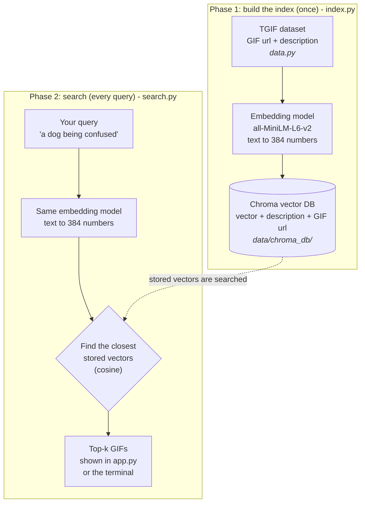

# GIF Search (semantic search PoC)

Type a sentence like *"a dog being confused"* and get matching GIFs. Small replica of the
[Pinecone GIF search article](https://www.pinecone.io/learn/gif-search/), using a **local Chroma DB**
instead of Pinecone, and a **5,000-GIF subset** of the TGIF dataset so it runs in minutes.

## Where to start
1. Read **How it works** below.
2. Do the setup steps, then run `notebooks/concepts.ipynb` to learn the ideas (about 20 minutes).
3. Build the index and try the app.
4. Read the code in order: `data.py`, `index.py`, `search.py`, `app.py`.

## Prerequisites
- Python 3.10+ (developed on 3.13)
- ~2 GB disk (PyTorch + model), internet on first run (dataset ~18 MB, model ~90 MB)

## How it works

The project has two phases. Phase 1 runs once. Phase 2 runs on every search.



1. **Retriever**: `all-MiniLM-L6-v2` turns text into a vector. Similar meaning = close vectors.
2. **Vector DB**: Chroma stores vectors plus the GIF url and finds the nearest ones (cosine).
3. **Show**: GIFs are hot-linked from their original URLs.

The same model must be used in both phases. Otherwise the query vector and the stored vectors are not comparable.

## Files

| File | Job |
|------|-----|
| `config.py` | All settings: paths, model name, batch size |
| `data.py` | Download and load the TGIF dataset |
| `index.py` | Encode descriptions, save to Chroma |
| `search.py` | `search_gif(query, k)` |
| `app.py` | Streamlit UI |
| `notebooks/concepts.ipynb` | Start here: explains embeddings, similarity and vector DBs (no index needed) |
| `notebooks/gif_search.ipynb` | Step-by-step notebook on the real GIF data |
| `data/` | Generated, git-ignored: dataset (`tgif-v1.0.tsv`) and database (`chroma_db/`) |

```
.
├── config.py        settings
├── data.py          step 1: data
├── index.py         step 2: build index
├── search.py        step 3: search
├── app.py           step 4: web app
├── notebooks/       concepts.ipynb, gif_search.ipynb
└── data/            generated, not in git
    ├── tgif-v1.0.tsv
    └── chroma_db/
```

## Step by step

### 1. Create and activate a virtual environment (PowerShell)
```powershell
python -m venv .venv
.venv\Scripts\Activate.ps1
```
macOS/Linux: `python3 -m venv .venv && source .venv/bin/activate`

### 2. Install dependencies
```powershell
pip install -r requirements.txt
```

### 3. Build the index
```powershell
python index.py --limit 5000
```
This downloads the dataset to `data/`, encodes 5,000 random descriptions, and saves them to `data/chroma_db/`.
Takes ~1-2 minutes on CPU. Safe to re-run: it skips if the index already exists. Want more? Use a bigger `--limit` (full set is ~125k, much slower).

### 4. Try a search in the terminal
```powershell
python search.py a dog being confused
```

### 5. Run the web app
```powershell
streamlit run app.py
```

### 6. Or run the notebooks
```powershell
python -m ipykernel install --user --name gif-search
jupyter notebook notebooks/
```
Open `concepts.ipynb` first, then `gif_search.ipynb` (needs step 3). Pick kernel `gif-search`. Run cells top to bottom (outputs are stripped in git).

## Example queries
- a dog being confused
- animals being cute
- a fluffy dog being cute and dancing like a person

## Troubleshooting
- **Broken images**: GIFs are hosted on Tumblr, some links are dead. Normal.
- **`ModuleNotFoundError` in a notebook** (for example `No module named 'chromadb'`): the notebook is using the wrong Python. Select the `.venv` kernel: in VS Code click **Select Kernel** (top right) and pick `.venv`; in Jupyter use **Kernel > Change kernel > gif-search** (see step 6).
- **"No GIF index found"**: run `python index.py` first.
- **Want to re-index**: delete the `data/chroma_db/` folder and run `index.py` again.
- **Few results look right**: only 5,000 GIFs indexed. Raise `--limit`.

## Next steps

Pick one and build it as a team project. Every idea reuses `search_gif(query, k)` from `search.py`, so you only write the new "front door".

| Idea | What you build | Good to learn | Difficulty |
|------|----------------|---------------|------------|
| **REST API** | A [FastAPI](https://fastapi.tiangolo.com/) app with `GET /search?q=...&k=9` that returns the results as JSON | HTTP, JSON, API docs | Easy |
| **Discord bot** | A bot with a `/gif <description>` command that replies with the best GIF url (Discord shows the GIF inline) using [discord.py](https://discordpy.readthedocs.io/) | Bots, async code, tokens and secrets | Medium |
| **Deploy the web app** | Put `app.py` online with [Streamlit Community Cloud](https://streamlit.io/cloud) or [Hugging Face Spaces](https://huggingface.co/spaces). The index is not in git, so build it on startup or host it separately | Deployment, environment setup | Medium |
| **Custom web page** | A small React or plain HTML page that calls your REST API | Frontend, calling APIs | Medium |
| **Docker image** | A `Dockerfile` that installs the requirements and builds the index, so anyone can run the project with one command | Containers, reproducibility | Medium |
| **Better search** | Index the full 125k dataset, try a bigger embedding model, or add a "more like this" button | Search quality, evaluation | Medium to hard |

Tips for any of these:
- Never commit secrets (Discord tokens, API keys). Put them in environment variables or a `.env` file. `.env` is already git-ignored.
- The model takes a few seconds to load, so load it once when the program starts. `search.py` already does this.
- Free hosting has limited memory. The 5,000-GIF index is small enough. The full dataset may not be.

## Differences from the article
- Chroma (local, no API key) instead of Pinecone.
- Subset of data by default.
- Streamlit and notebook both included.

## Notes
Everything generated lives in `data/` and is git-ignored. Paths come from `config.py` and are relative to the repo, so scripts run from any folder.
