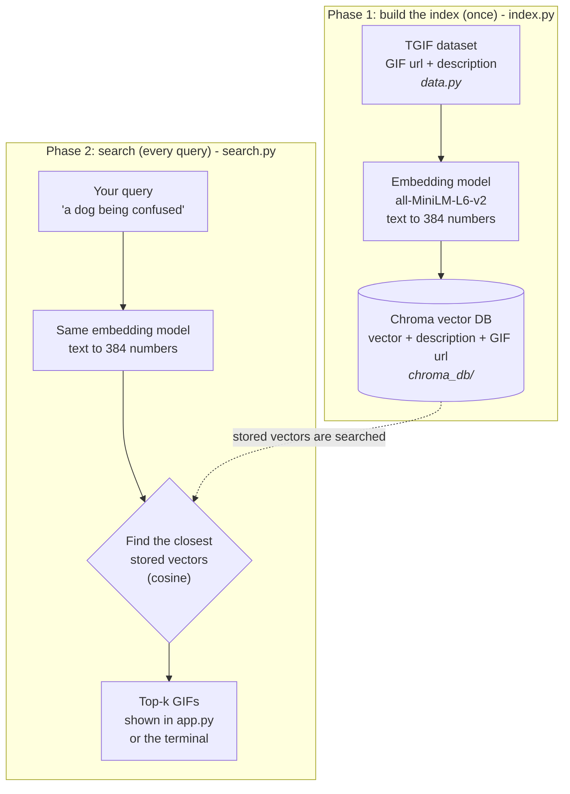

# GIF Search (semantic search PoC)

Type a sentence like *"a dog being confused"* and get matching GIFs. Small replica of the
[Pinecone GIF search article](https://www.pinecone.io/learn/gif-search/), using a **local Chroma DB**
instead of Pinecone, and a **5,000-GIF subset** of the TGIF dataset so it runs in minutes.

## Prerequisites
- Python 3.10+ (developed on 3.13)
- ~2 GB disk (PyTorch + model), internet on first run (dataset ~18 MB, model ~90 MB)

## How it works

The project has two phases. Phase 1 runs once. Phase 2 runs on every search.



1. **Retriever**: `all-MiniLM-L6-v2` turns text into a vector. Similar meaning = close vectors.
2. **Vector DB**: Chroma stores vectors plus the GIF url and finds the nearest ones (cosine).
3. **Show**: GIFs are hot-linked from their original URLs.

The same model must be used in both phases. Otherwise the query vector and the stored vectors are not comparable.

## Files

| File | Job |
|------|-----|
| `data.py` | Download and load the TGIF dataset |
| `index.py` | Encode descriptions, save to Chroma |
| `search.py` | `search_gif(query, k)` |
| `app.py` | Streamlit UI |
| `gif_search.ipynb` | Step-by-step notebook |

## Step by step

### 1. Create and activate a virtual environment (PowerShell)
```powershell
python -m venv .venv
.venv\Scripts\Activate.ps1
```
macOS/Linux: `python3 -m venv .venv && source .venv/bin/activate`

### 2. Install dependencies
```powershell
pip install -r requirements.txt
```

### 3. Build the index
```powershell
python index.py --limit 5000
```
This downloads the dataset to `data/`, encodes 5,000 random descriptions, and saves them to `chroma_db/`.
Takes ~1-2 minutes on CPU. Safe to re-run: it skips if the index already exists. Want more? Use a bigger `--limit` (full set is ~125k, much slower).

### 4. Try a search in the terminal
```powershell
python search.py a dog being confused
```

### 5. Run the web app
```powershell
streamlit run app.py
```

### 6. Or run the notebook
```powershell
python -m ipykernel install --user --name gif-search
jupyter notebook gif_search.ipynb
```
Pick kernel `gif-search`. Run cells top to bottom (outputs are stripped in git).

## Example queries
- a dog being confused
- animals being cute
- a fluffy dog being cute and dancing like a person

## Troubleshooting
- **Broken images**: GIFs are hosted on Tumblr, some links are dead. Normal.
- **"No GIF index found"**: run `python index.py` first.
- **Want to re-index**: delete the `chroma_db/` folder and run `index.py` again.
- **Few results look right**: only 5,000 GIFs indexed. Raise `--limit`.

## Differences from the article
- Chroma (local, no API key) instead of Pinecone.
- Subset of data by default.
- Streamlit and notebook both included.

## Notes
`data/` and `chroma_db/` are generated and git-ignored. Scripts resolve paths relative to the repo, so they run from any folder.
